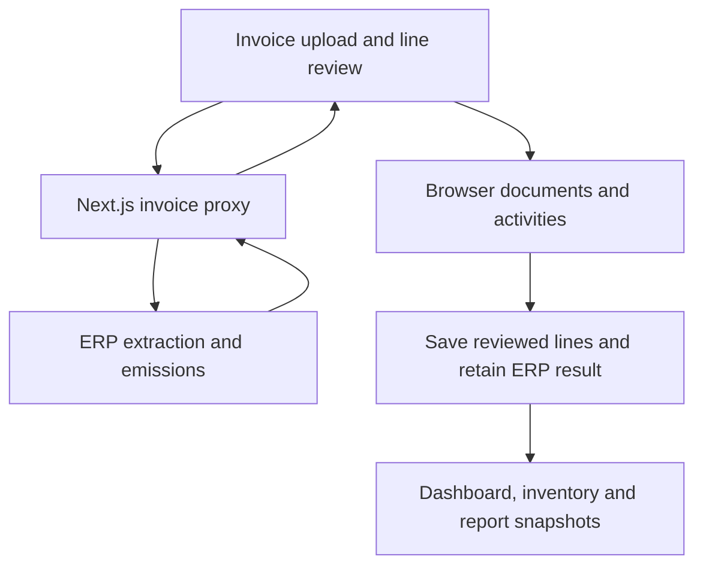

# University demo and invoice backend integration

## Implemented scope

The university frontend expects a V2 API absent from the supplied backend. This bundle retains the explicit demo adapter for that workspace and implements a separate invoice bridge to the working ERP service. Changing only the V2 API base URL still cannot connect the whole product.

| Feature | Runtime used in this bundle |
| --- | --- |
| Login, onboarding, hierarchy, periods, locks | Browser demo adapter |
| Manual/Excel intake and non-invoice calculations | Browser adapter and illustrative factors |
| PDF/PNG/JPEG invoice extraction and emissions | Supplied backend `POST /api/erp/upload` |
| Invoice metadata, selected-row saving and review workflow | Browser adapter with original backend results |
| Reviewed invoice Save & calculate | Original ERP CO2 result retained immediately if matching; unmatched/edited lines pending |
| Dashboard, inventory, reports and university records | Local aggregation/snapshots, including calculated invoice rows |

## Data flow

`src/lib/invoice-proxy.ts` forwards actual file bytes to the canonical multipart `file` field. It checks demo session/origin, a 10 MB file limit and PDF/PNG/JPEG signatures. Backend URL, optional bearer token and timeout are server-only environment variables. No provider credential is placed in browser code. `/api/invoices/status` checks the supplied backend root health response.

`src/lib/invoice-contract.ts` normalizes generic country-engine and nested Malaysia results. It retains line identity, original consumption/unit, converted quantity, returned CO2, category, factor value/unit/source/dataset/year, provider, country and invoice date. It ignores backend debug/raw-provider payloads. Unknown or failed results retain review issues and null emissions; valid zero results remain zero.

`src/lib/invoice-client.ts` bypasses the demo transport for extraction, then registers compact normalized results in the local adapter. Batch files process sequentially to avoid parallel provider bursts. Failures remain visible per file, with successful files available for review.

`src/lib/demo-api.ts` validates all selected lines before import, checks hierarchy/dates/locks and rejects duplicate source lines. Explicit Save & calculate confirms reviewed fields and retains matching original invoice results. Changed consumption, unit, category or invoice year requires a new backend calculation; those rows stay SUBMITTED with no calculated emissions. Legacy draft/verify/calculate endpoints remain available. Recalculation replaces the result and cannot double count it. Deleting a draft/rejected invoice row releases its import marker.

Reopening an invoice reads the linked activity records so reviewed quantities, units, status and campus/building/floor remain visible, while original extraction values stay immutable. Source data appears in Review's extracted-versus-entered comparison. Document Hub opens stored invoice lines without running preset OCR. Old metadata-only documents can be re-uploaded through the connected flow.

## Backend configuration and preservation

Invoice extraction and country-specific calculation logic are retained. Deployment changes upgrade Docker to Node 24, keep Multer in production dependencies, copy report templates into dist, bind a numeric PORT on 0.0.0.0 and add optional server-token authentication to API routes. The Blueprint generates and shares this token with the frontend server; local use without a token stays compatible. Reuse your working Supabase, database and provider setup. No database migration or restore is performed. The original database backup and bundled generated report remain in this archive. The Docker build excludes the backup and generated folders; no restore is performed.

Original entry point: `backend/src/app.ts`. Canonical upload: `backend/src/routes/erp.routes.ts`. The configured extraction orchestrator tries Gemini and fallback Affinda/Mistral paths. Country detection selects the existing emissions pipeline. The backend also has invoice review/mapping routes and an invoice-report route `POST /api/generate-invoice-report`; these are not university V2 contracts. The mounted `/api/report` router is empty.

## Remaining boundaries

Workspace auth and persistence remain single-browser demonstration facilities. The real invoice backend is responsible for its own provider and database behavior. Normalized results and activities are saved locally; this frontend does not retain uploaded binary evidence or synchronize review status with the backend's separate invoice mapping tables.

Fresh login opens university onboarding, then Activity Data. Profile save is atomic in the adapter, so the wizard does not recreate the hierarchy or overlapping fiscal periods. An incomplete demo profile is redirected to onboarding. Returning login resumes Activity Data. Onboarding drafts, profile and user inventory persist in browser storage.

The seed contains 2 campuses, 4 buildings, 12 floors and 222 activities. Initial current-period totals are illustrative: 692.237 tCO2e (Scope 1 86.572, Scope 2 605.665). `dataMode=SAMPLE` retains preview data through onboarding and upload/Excel preview. Only a successful activity save or confirmed import switches to `dataMode=USER`, removing tagged sample activities and sample-derived baselines, targets and recommendations. It never reverts because a period has no user rows; only explicit Reset demo restores samples. Version-1 browser workspaces migrate while preserving existing user rows and documents. Reports preserve the mode in their snapshots.

Manual/Excel Save & calculate uses illustrative factors for user-entered quantities. Invoice rows retain actual backend results. Samples and user rows do not share active totals. Draft/pending rows affect record counts but are excluded from emission totals. Workspace change events refresh an open dashboard; subsequent entries accumulate and snapshot reports remain immutable.

A production university deployment still needs secure V2 authentication, organization isolation, durable activities/documents/calculations, permissions and server report storage. `NEXT_PUBLIC_DEMO_MODE=false` is for a separately compatible V2 service, not for this hybrid configuration.

No provider credentials, database restores or live provider requests were used in this preparation. Local proxy and browser integration checks use representative ERP response shapes; use your working configuration to validate actual invoice extraction.
